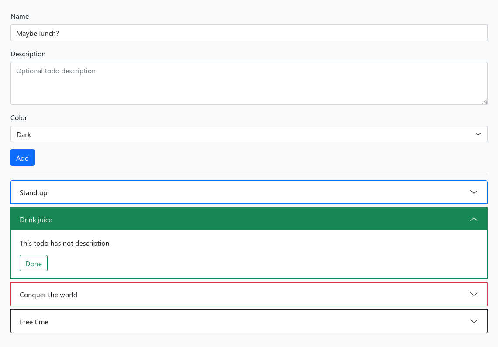

# Simple Todo App

It's a simpe todo list created with react.

Now you can:
- create new task with a name, description and color
- see your tasks
- done your tasks

# Installation
Clone repository

    git clone https://github.com/LordHippopotamus/todo.git

Install dependencies(make sure you have node js installed)

    git install

Run it

    npm start

# Components
### TodoForm
Here the user can create new tasks.

### TodoList
Here the user can see the tasks.

### TodoListItem
Single task that is displayed in the TodoList. The user can mark this as completed.